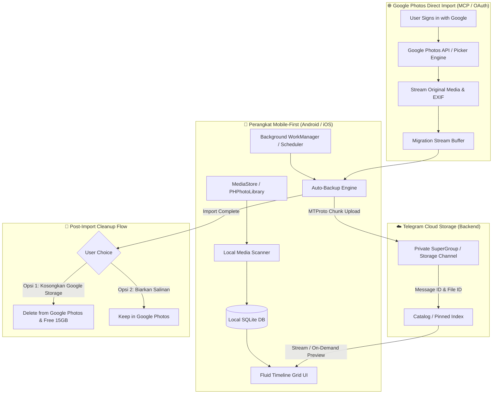
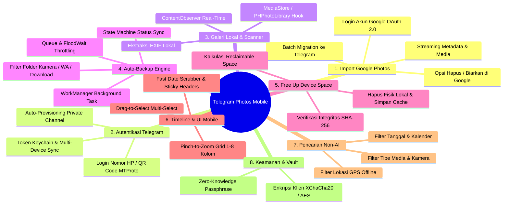
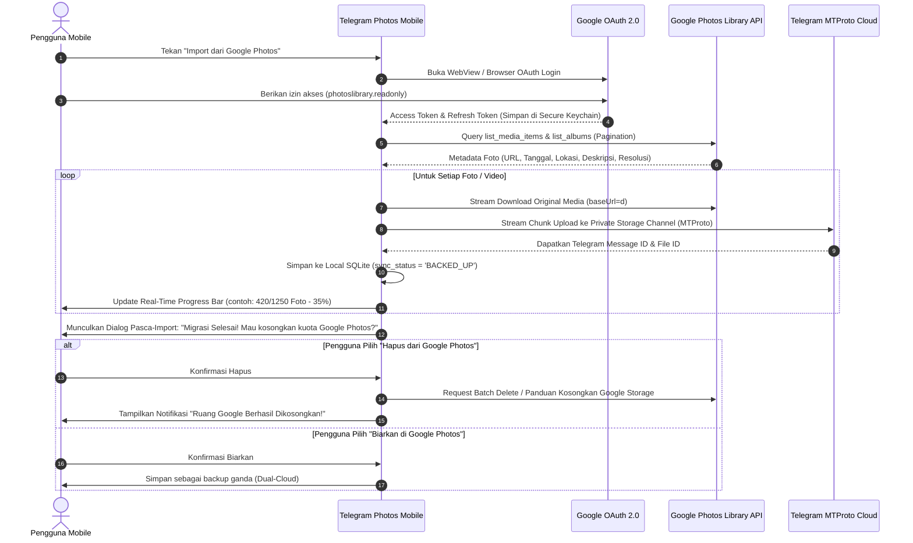
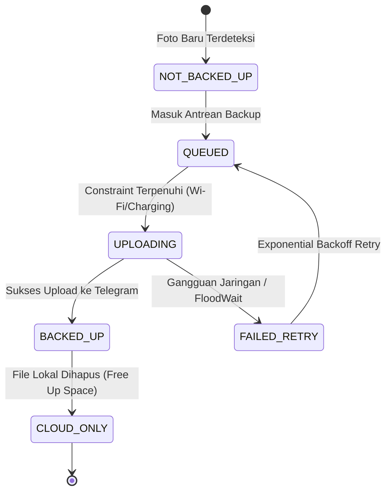
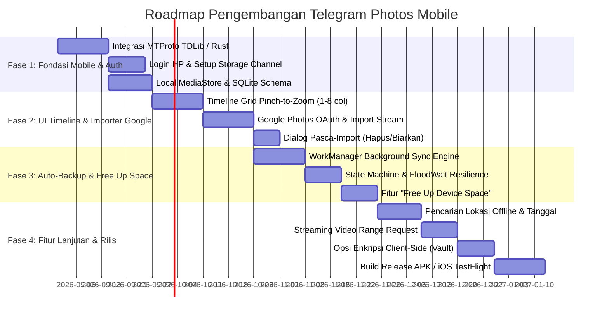
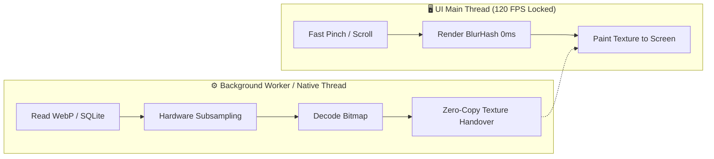

# 📱 Product Requirement Document (PRD): Telegram Photos
**Mobile-First Cloud Photo Gallery & Auto-Backup Powered by Telegram Cloud with 1-Click Google Photos Importer**

---

## 1. 📋 Ringkasan Eksekutif & Visi Produk

### 1.1 Visi Produk
**Telegram Photos** adalah aplikasi galeri foto dan video **Mobile-First** (Android & iOS) yang mengadopsi antarmuka serta alur kerja intuitif seperti **Google Photos**, namun menggunakan infrastruktur cloud **Telegram** (via MTProto / Bot API / Private Channels) sebagai penyimpanan cloud gratis tanpa batas (*unlimited free cloud storage*).

Aplikasi ini dirancang khusus untuk pengguna mobile yang ingin beralih dari Google Photos atau membutuhkan cadangan foto otomatis tanpa batas kuota 15 GB, dengan prinsip utama:
1. **Mobile-First Priority**: Dibangun dari awal untuk perangkat Android (APK) dan iOS (IPA) dengan optimalisasi konsumsi baterai, integrasi native `MediaStore`/`PHPhotoLibrary`, gestur sentuh mulus, dan *background synchronization*.
2. **Fitur Import 1-Klik dari Google Photos (Migrasi Akun)**: Pengguna cukup menghubungkan akun Google mereka (memanfaatkan arsitektur *Google Photos API & MCP Server*), lalu sistem akan menyedot/mengimpor seluruh foto, video, dan album dari Google Photos langsung ke cloud Telegram secara otomatis.
3. **Pilihan Pasca-Import Fleksibel (Kosongkan Kuota Google / Biarkan)**: Setelah proses migrasi selesai, pengguna diberikan opsi:
   - **Opsi A (Hapus dari Google Photos)**: Menghapus foto dari Google Photos untuk membebaskan kuota 15 GB Google One / Google Drive agar tidak perlu bayar langganan bulanan.
   - **Opsi B (Biarkan di Google Photos)**: Mempertahankan salinan di kedua tempat sebagai *dual-cloud redundancy*.
4. **Otomatisasi Penuh (Auto-Backup Background)**: Foto yang baru diambil kamera HP langsung ter-backup otomatis ke channel Telegram privat saat terkoneksi Wi-Fi / charger.
5. **Tanpa AI Organizer Berat / Tanpa Blackbox AI**: Pengorganisasian 100% berbasis metadata deterministik (waktu EXIF, tanggal, lokasi GPS reverse-geocode lokal, tipe file, model kamera, dan folder perangkat).
6. **UX Setara Google Photos**: Tampilan *pinch-to-zoom timeline grid* (1-8 kolom), penanda status backup (*cloud badges*), *drag-to-select*, dan fitur **"Kosongkan Ruang Perangkat" (Free Up Device Space)**.
7. **Privasi & Keamanan Klien**: Data tersimpan di *Private Storage Channel* milik akun Telegram pengguna sendiri dengan opsi enkripsi *Zero-Knowledge* (XChaCha20-Poly1305 / AES-256-GCM).

---

## 2. 🎯 Target Pengguna & Value Proposition

| Segmen Pengguna | Masalah Utama Saat Ini | Solusi Telegram Photos |
| :--- | :--- | :--- |
| **Pengguna Google Photos yang Kehabisan Kuota 15 GB** | Peringatan memori Google penuh, Gmail & Google Drive terblokir jika tidak berlangganan Google One. | **1-Click Import dari Google Photos** ke Telegram, lalu hapus dari Google Photos untuk mengembalikan kuota 15 GB menjadi lega kembali 100% gratis. |
| **Pengguna HP dengan Memori Internal Penuh** | Memori HP cepat habis karena video 4K dan foto resolusi tinggi. | Fitur **"Kosongkan Ruang Perangkat" (Free Up Space)** menghapus file lokal yang sudah ter-backup di Telegram, sambil tetap menampilkan thumbnail kilat. |
| **Pengguna yang Mengutamakan Privasi** | Google memindai metadata foto pengguna untuk periklanan dan model AI. | Foto tersimpan di channel privat Telegram milik pengguna tanpa ada pemindaian AI cloud pihak ketiga. |
| **Fotografer & Kreator Konten Mobile** | File RAW dan video berukuran gigabyte cepat menghabiskan kuota cloud berbayar. | Telegram mendukung file hingga **2 GB per file** (atau 4 GB dengan Telegram Premium) tanpa batasan jumlah total file. |

---

## 3. 🔍 Arsitektur Alur: Google Photos Reverse-Engineering & Telegram Cloud



---

## 4. ⚙️ Spesifikasi Fungsional & Modul Utama



---

### 4.1. Modul 1: Fitur Import 1-Klik dari Google Photos (Cloud Migration Engine)

Fitur ini mengintegrasikan arsitektur **Google Photos API & MCP (Model Context Protocol) Server Pattern** yang memungkinkan migrasi total secara mulus:



#### Detail Spesifikasi Teknis Import Google Photos:
1. **Autentikasi Akun Google**:
   - OAuth 2.0 flow terintegrasi dengan scope: `https://www.googleapis.com/auth/photoslibrary.readonly` (dan opsional scope delete jika tersedia).
   - Penyimpanan token aman menggunakan **Android EncryptedSharedPreferences** / **iOS Keychain**.
2. **Streaming Pipeline Cerdas (Tanpa Memenuhi Memori HP)**:
   - Proses transfer menggunakan *streaming buffer* (chunk 2 MB - 4 MB). File di-download dari endpoint Google Photos (`baseUrl=d` untuk kualitas asli) dan langsung dialirkan (*piped*) ke MTProto Telegram upload queue tanpa harus menyimpan file utuh ke memori internal HP.
3. **Preservasi Metadata & Album**:
   - Struktur album di Google Photos secara otomatis dipetakan menjadi album di Telegram Photos.
   - Metadata tanggal asli (*creationTime*), deskripsi foto, dan koordinat GPS dipertahankan secara utuh di database SQLite dan caption Telegram.
4. **Deduplikasi (Anti-Duplikat)**:
   - Sistem memeriksa hash SHA-256 dan Google Media ID. Jika foto sudah ada di galeri lokal atau sudah pernah di-backup, sistem melewatinya (*skip*) untuk menghemat bandwidth.
5. **Opsi Pasca-Import (Post-Import Action Dialog)**:
   - **Opsi 1: "Kosongkan Kuota Google Photos"**:
     - Membantu pengguna menghapus file yang berhasil dipindahkan ke Telegram dari akun Google mereka.
     - Menyediakan rekapitulasi: *"12.4 GB kuota Google Drive Anda telah berhasil dibebaskan"*.
   - **Opsi 2: "Biarkan Salinan di Google Photos"**:
     - Menjaga file tetap utuh di Google Photos sebagai salinan cadangan ganda (*dual-redundancy*).

---

### 4.2. Modul 2: Autentikasi & Penyimpanan Cloud Telegram

1. **Metode Login Telegram**:
   - Pengguna memasukkan nomor telepon dan menerima kode OTP resmi dari Telegram.
   - Mendukung **Two-Factor Authentication (2FA Cloud Password)** Telegram.
   - Koneksi langsung dari HP ke server MTProto Telegram (tanpa server perantara pihak ketiga).
2. **Inisialisasi Channel Brankas (Storage Vault)**:
   - Aplikasi otomatis mendeteksi atau membuat **Private Channel** khusus bernama `TelegramPhotos_Vault`.
   - Channel ini 100% privat dan tersembunyi dari daftar chat utama (diarsipkan atau dipin secara khusus).
3. **Batas Ukuran File**:
   - Mendukung file foto & video hingga **2 GB per file** (atau **4 GB** untuk pengguna Telegram Premium).
   - Format asli (*Original Quality*) tanpa kompresi paksa.

---

### 4.3. Modul 3: Local Gallery Engine & Media Scanning (Mobile-First)

1. **Integrasi Native Galeri Mobile**:
   - **Android**: Integrasi `MediaStore.Images` & `MediaStore.Video` dengan `ContentObserver` untuk deteksi perubahan file secara *real-time*.
   - **iOS**: Integrasi `PHPhotoLibrary` dengan `PHPhotoLibraryChangeObserver`.
2. **Ekstraksi Metadata EXIF Lokal (Cepat & Offline)**:
   - Waktu Pengambilan (`Date Taken / EXIF Timestamp`).
   - Dimensi Resolusi & Orientasi Rotasi.
   - Koordinat Geografis (`GPS Latitude & Longitude`).
   - Model Kamera & Perangkat (Samsung Galaxy, iPhone, Sony Alpha, Xiaomi, dll.).
   - Pengaturan Kamera (`ISO`, `Aperture`, `Shutter Speed`, `Focal Length`).
   - Ukuran File, Ekstensi & MIME Type.
   - Hash `SHA-256` untuk verifikasi integritas data.

---

### 4.4. Modul 4: Engine Auto-Backup Background (Google Photos Parity)

1. **Background Job Orchestration**:
   - Menggunakan **Android WorkManager** & **iOS BGTaskScheduler** dengan *Foreground Notification Service* saat proses backup sedang berlangsung.
2. **Aturan & Batasan Backup (User Constraints)**:
   - **Jaringan**: Pilihan `Hanya Wi-Fi` (default) atau `Wi-Fi + Data Seluler`.
   - **Daya**: Pilihan `Hanya saat Diisi Daya (Charging)` atau `Kapan Saja`.
   - **Pemilihan Folder**: Pengguna dapat mengaktifkan/menonaktifkan backup folder tertentu (Kamera: ON, WhatsApp: ON, Screenshots: OPTIONAL, Download: OFF).
3. **State Machine Status Backup**:



4. **Penanganan Rate Limit & Anti-FloodWait Telegram**:
   - Antrean berurutan dengan jeda 300ms - 500ms antar file.
   - Jika Telegram mengembalikan error `FLOOD_WAIT_X`, sistem otomatis melakukan jeda (*sleep*) selama `X + 2` detik lalu melanjutkan antrean secara otomatis tanpa crash.

---

### 4.5. Modul 5: Fitur "Kosongkan Ruang Perangkat" (Free Up Space)

1. **Kalkulasi Ruang Aman**:
   - Sistem memindai seluruh file lokal yang statusnya sudah terkonfirmasi `BACKED_UP` di Telegram.
   - Menghitung total ukuran yang bisa dihemat (contoh: *"Bebaskan 16.2 GB ruang penyimpanan HP Anda"*).
2. **Eksekusi Penghapusan Aman**:
   - Pengguna menekan tombol konfirmasi.
   - Sistem memverifikasi kembali bahwa file id di Telegram masih valid.
   - File fisik di memori HP dihapus; status di database diubah menjadi `CLOUD_ONLY`.
   - **Thumbnail Ringan (WebP 20-40 KB / BlurHash)** tetap disimpan di memori HP agar pengguna tetap bisa melihat seluruh foto secara instan tanpa perlu koneksi internet.

---

### 4.6. Modul 6: Timeline Grid & Interaksi Gestur Mobile

1. **Pinch-to-Zoom Multi-Scale Grid**:
   - Skala 1: **1 Kolom** (Tampilan Detail Harian Penuh).
   - Skala 2: **3 Kolom** (Tampilan Standar Google Photos).
   - Skala 3: **5 Kolom** (Tampilan Ringkas Bulanan).
   - Skala 4: **8 Kolom** (Tampilan Heatmap Tahunan).
2. **Sticky Date Header & Fast Scrubber**:
   - Header tanggal melayang di atas grid saat scroll.
   - Penggeser cepat (*fast date scrubber*) di sisi kanan dengan indikator gelembung bulan & tahun.
3. **Drag-to-Select Multi-Item**:
   - Tekan dan tahan (*long press*) foto untuk masuk mode seleksi, lalu seret jari untuk memilih puluhan foto sekaligus dalam hitungan detik.

---

### 4.7. Modul 7: Sistem Pengorganisasian & Pencarian (Tanpa AI)

1. **Pencarian Berdasarkan Waktu & Kalender**:
   - Filter Tahun, Bulan, dan rentang tanggal spesifik.
2. **Pencarian Lokasi (Reverse Geocoding Offline)**:
   - Koordinat GPS dari EXIF dipetakan secara offline menggunakan database lokal ringan (GeoNames / OSM SQLite) menjadi nama Kota dan Negara.
3. **Pencarian Berdasarkan Kategori Tipe File & Perangkat**:
   - Chip filter cepat: `Video`, `Tangkapan Layar`, `Favorit`, `Foto RAW`, `30 Hari Terakhir`.
   - Filter model kamera/HP (misal: "Foto dari Samsung S24", "Foto dari Sony A7").
4. **Struktur Koleksi**:
   - Folder Perangkat, Album Kustom, Favorit (Bintang/Hati), Arsip, dan Sampah (*Trash Bin* dengan retensi 30 hari).

---

### 4.8. Modul 8: Keamanan & Enkripsi Opsional (Zero-Knowledge)

1. **Mode Standar**: File tersimpan dalam bentuk asli di channel privat Telegram pengguna.
2. **Mode Enkripsi Klien (Vault)**: File dienkripsi secara lokal sebelum dikirim ke Telegram menggunakan **XChaCha20-Poly1305** atau **AES-256-GCM** dengan kunci yang diturunkan dari passphrase pengguna (**Argon2id**). Pihak Telegram tidak dapat melihat isi foto.

---

## 5. 🗄️ Skema Database SQLite Lokal (`telegram_photos.db`)

```sql
-- Tabel Media Utama (Lokal, Cloud Telegram, dan Impor Google Photos)
CREATE TABLE media_items (
    id TEXT PRIMARY KEY,                       -- UUID unik
    local_identifier TEXT UNIQUE,              -- ID dari MediaStore Android / iOS (jika ada di HP)
    file_name TEXT NOT NULL,                   -- contoh: IMG_20260817_120530.jpg
    file_path TEXT,                            -- Path lokal jika ada di HP
    mime_type TEXT NOT NULL,                   -- image/jpeg, video/mp4, image/heic, dll
    file_size_bytes INTEGER NOT NULL,          -- Ukuran file asli
    sha256_hash TEXT NOT NULL,                 -- Hash untuk integritas & anti-duplikasi
    
    -- Metadata Waktu
    date_taken_timestamp INTEGER NOT NULL,     -- Unix epoch (ms) dari EXIF / Google Photos
    date_added_timestamp INTEGER NOT NULL,     -- Waktu ditambahkan ke aplikasi
    
    -- Metadata Dimensi & Rotasi
    width INTEGER,
    height INTEGER,
    orientation INTEGER DEFAULT 0,
    duration_ms INTEGER DEFAULT 0,             -- Durasi jika video
    
    -- Metadata EXIF Perangkat & Kamera
    camera_make TEXT,                          -- contoh: Samsung, Apple
    camera_model TEXT,                         -- contoh: SM-S928B
    focal_length REAL,
    aperture REAL,
    iso INTEGER,
    exposure_time TEXT,
    
    -- Metadata Lokasi Geografis (Offline Reverse Geocode)
    latitude REAL,
    longitude REAL,
    geo_city TEXT,                             -- contoh: Jakarta, Surabaya, Tokyo
    geo_country TEXT,                          -- contoh: Indonesia, Japan
    
    -- Status Sinkronisasi Telegram
    sync_status TEXT NOT NULL DEFAULT 'NOT_BACKED_UP', 
    -- Nilai: 'NOT_BACKED_UP', 'QUEUED', 'UPLOADING', 'BACKED_UP', 'CLOUD_ONLY', 'FAILED'
    
    -- Pointer Telegram Cloud
    tg_channel_id INTEGER,                     -- ID Private Channel penyimpanan
    tg_message_id INTEGER,                     -- ID Pesan di Telegram
    tg_file_id TEXT,                           -- Telegram file_id
    tg_access_hash INTEGER,                    -- Telegram access hash
    tg_file_reference BLOB,                    -- Telegram dynamic file reference
    
    -- Integrasi Google Photos Importer
    imported_from_google_photos INTEGER DEFAULT 0, -- 1 = Hasil import dari Google Photos
    google_photos_media_id TEXT,               -- ID asli di Google Photos
    google_cleanup_status TEXT DEFAULT 'NONE', -- 'NONE', 'QUEUED_FOR_DELETE', 'DELETED_FROM_GOOGLE'
    
    -- Cache Thumbnail & Placeholder
    thumbnail_path TEXT,                       -- Path thumbnail WebP lokal (200x200)
    preview_path TEXT,                         -- Path preview resolusi sedang (1200px)
    blurhash TEXT,                             -- String BlurHash untuk rendering placeholder
    
    -- Koleksi & Status
    is_favorite INTEGER DEFAULT 0,             -- 1 = Ya, 0 = Tidak
    is_archived INTEGER DEFAULT 0,             -- 1 = Ya, 0 = Tidak
    is_trashed INTEGER DEFAULT 0,              -- 1 = Ya, 0 = Tidak
    trashed_timestamp INTEGER,                 -- Waktu masuk sampah
    is_encrypted INTEGER DEFAULT 0             -- 1 jika terenkripsi Vault
);

-- Indeks Performa Tinggi untuk Query Galeri 120 FPS
CREATE INDEX idx_media_date_taken ON media_items(date_taken_timestamp DESC);
CREATE INDEX idx_media_sync_status ON media_items(sync_status);
CREATE INDEX idx_media_geo_city ON media_items(geo_city);
CREATE INDEX idx_media_is_trashed ON media_items(is_trashed);
CREATE INDEX idx_media_sha256 ON media_items(sha256_hash);
CREATE INDEX idx_media_google_id ON media_items(google_photos_media_id);

-- Tabel Riwayat Sesi Migrasi Google Photos
CREATE TABLE google_import_sessions (
    session_id TEXT PRIMARY KEY,
    google_account_email TEXT NOT NULL,
    started_at INTEGER NOT NULL,
    completed_at INTEGER,
    total_items_found INTEGER DEFAULT 0,
    items_imported_success INTEGER DEFAULT 0,
    items_imported_failed INTEGER DEFAULT 0,
    total_bytes_migrated INTEGER DEFAULT 0,
    post_cleanup_choice TEXT,                  -- 'DELETE_FROM_GOOGLE' atau 'KEEP_IN_GOOGLE'
    cleanup_completed_at INTEGER,
    status TEXT NOT NULL                       -- 'RUNNING', 'COMPLETED', 'PAUSED', 'FAILED'
);

-- Tabel Album & Relasi
CREATE TABLE albums (
    id TEXT PRIMARY KEY,
    name TEXT NOT NULL,
    created_at INTEGER NOT NULL,
    cover_media_id TEXT,
    is_pinned INTEGER DEFAULT 0,
    source_type TEXT DEFAULT 'LOCAL',          -- 'LOCAL' atau 'GOOGLE_PHOTOS'
    FOREIGN KEY (cover_media_id) REFERENCES media_items(id)
);

CREATE TABLE album_media_map (
    album_id TEXT NOT NULL,
    media_id TEXT NOT NULL,
    added_at INTEGER NOT NULL,
    PRIMARY KEY (album_id, media_id),
    FOREIGN KEY (album_id) REFERENCES albums(id) ON DELETE CASCADE,
    FOREIGN KEY (media_id) REFERENCES media_items(id) ON DELETE CASCADE
);

-- Tabel Pengaturan Folder Backup Lokal
CREATE TABLE backup_folders (
    folder_path TEXT PRIMARY KEY,
    folder_name TEXT NOT NULL,
    is_backup_enabled INTEGER DEFAULT 1,
    last_scanned_timestamp INTEGER
);
```

---

## 6. 📱 Desain Antarmuka Mobile-First & Layar Khusus

### 6.1. Layar Wizard Migrasi Google Photos (1-Click Migration)

```
┌────────────────────────────────────────────────────────┐
│ ← Migrasi dari Google Photos                           │
├────────────────────────────────────────────────────────┤
│  [ Google Photos Icon ] ➔➔ [ Telegram Cloud Icon ]     │
│                                                        │
│  Pindahkan Seluruh Foto & Video Anda ke Telegram       │
│  Bebaskan kuota 15 GB Google One Anda selamanya.       │
│                                                        │
│  ┌──────────────────────────────────────────────────┐  │
│  │ 👤 Akun Google: user@gmail.com                   │  │
│  │ 📊 Total Foto Ditemukan: 3,420 item (~14.2 GB)   │  │
│  │ 📁 Termasuk 12 Album                             │  │
│  └──────────────────────────────────────────────────┘  │
│                                                        │
│  Status Migrasi:                                       │
│  Sedang Memindahkan: 1,240 / 3,420 item (36%)          │
│  [████████████░░░░░░░░░░░░░░░░░░░░░░] 4.8 MB/s         │
│  Estimasi Selesai: 18 Menit                            │
│                                                        │
│  [x] Salin Struktur Album                              │
│  [x] Pertahankan Kualitas Asli (Original RAW/4K)       │
│                                                        │
│  [ ⏸️ Jeda ]                  [ ⏹️ Batalkan ]          │
└────────────────────────────────────────────────────────┘
```

### 6.2. Dialog Konfirmasi Pasca-Import (Post-Import Cleanup Dialog)

```
┌────────────────────────────────────────────────────────┐
│ 🎉 Migrasi Google Photos Selesai!                      │
├────────────────────────────────────────────────────────┤
│ 3,420 foto dan video (14.2 GB) telah aman tersimpan di │
│ cloud Telegram Anda.                                   │
│                                                        │
│ Apa yang ingin Anda lakukan pada file di Google Photos?│
│                                                        │
│ 🔘 OPSI 1: Hapus dari Google Photos (Direkomendasikan) │
│    Bebaskan 14.2 GB ruang di akun Google Anda agar     │
│    tidak perlu membayar langganan Google One.          │
│    [ 🚀 Kosongkan 14.2 GB di Google Photos ]           │
│                                                        │
│ 🔘 OPSI 2: Biarkan di Google Photos                    │
│    Simpan salinan di kedua tempat (Telegram & Google)  │
│    sebagai cadangan ganda.                             │
│    [ 💾 Biarkan Salinan Tetap Ada ]                    │
└────────────────────────────────────────────────────────┘
```

---

## 7. 🛠️ Arsitektur Rekayasa Teknologi (Tech Stack)

| Lapisan | Komponen yang Direkomendasikan | Alasan Pemilihan |
| :--- | :--- | :--- |
| **Framework Mobile UI** | **Flutter** atau **React Native (Expo / Bare)** | Performa rendering 60/120 FPS untuk grid ribuan gambar, satu basis kode untuk Android (APK) & iOS (IPA). |
| **Telegram MTProto Client** | **TDLib (Telegram Database Library)** / **Grammers Rust** via FFI | Library resmi Telegram dengan performa C++/Rust native, mendukung chunk upload/download, resume otomatis, dan koneksi stabil. |
| **Google Photos Bridge** | **Google Photos REST API & OAuth 2.0 Client** | Terintegrasi langsung dengan endpoint `mediaItems.list`, `mediaItems.batchGet`, dan `albums.list`. |
| **Database Lokal** | **SQLite (Room di Android / Drift di Flutter)** | Performa query instan untuk ratusan ribu foto, ACID-compliant, sorting tanggal mulus. |
| **Image & Video Pipeline** | **Glide / Coil** + **ExoPlayer / AVPlayer** | Multi-tier disk/RAM cache, WebP decoding instan, streaming video chunk range MTProto. |
| **Background Processing** | **Android WorkManager** + **iOS BGTaskScheduler** | Menjamin backup otomatis dan migrasi Google Photos tetap berjalan di background secara konsisten. |
| **Reverse Geocoding** | **GeoNames / OpenStreetMap SQLite Lokal (~15 MB)** | Menerjemahkan koordinat GPS menjadi nama kota secara offline tanpa API eksternal dan tanpa AI. |

---

## 8. 🛡️ Penanganan Kendala Teknis & Mitigasi Risiko

### 8.1. Kuota API Google Photos & Token Refresh
- **Tantangan**: Token OAuth Google kedaluwarsa setelah 60 menit; kuota request per hari Google Photos API memiliki limitasi.
- **Mitigasi**:
  1. *Automatic Token Refresh*: Sistem otomatis memperbarui access token menggunakan `refresh_token` di latar belakang.
  2. *Batch Requests*: Menggunakan pagination ukuran 50-100 item per request untuk meminimalkan jumlah panggilan API.

### 8.2. Rate Limit & FloodWait Telegram
- **Mitigasi**: Throttling antrean upload dengan jeda adaptif (300ms - 500ms) dan penanganan otomatis respon `FLOOD_WAIT_X` dengan sleep timer tanpa crash.

### 8.3. Integritas Data & Anti-Loss
- **Mitigasi**: Setiap foto yang di-download dari Google Photos diverifikasi hash SHA-256 sebelum dan sesudah diunggah ke Telegram. Penghapusan dari Google Photos hanya diizinkan setelah status upload di Telegram berstatus `BACKED_UP` secara valid.

---

## 9. 📅 Roadmap Pengembangan Mobile-First (4 Fase)



---

## 11. ⚡ Arsitektur Optimasi Ekstrem & Efisiensi Ringan (Ultra-Lightweight Engineering)

Agar aplikasi **Telegram Photos** dapat berjalan sangat ringan, responsif, hemat baterai, dan mempertahankan **60 / 120 FPS tanpa lag** meskipun memuat **50.000 hingga 100.000+ foto**, berikut adalah blueprint optimasi teknis wajib:

### 11.1. Optimasi Rendering UI & Gestur Timeline (120 FPS Buttery Smooth)
1. **Virtualized Viewport & Memory Recycling**:
   - Grid hanya me-render elemen yang tampak di layar (*visible items*) ditambah buffer 1 layar ke atas/bawah. Widget/Cell yang keluar dari layar langsung di-recycle ke dalam *memory pool*.
2. **Sistem Thumbnail Multi-Tingkat (Multi-Tier WebP Thumbnails)**:
   - **Micro-Thumbnail (120x120 px, ~3–6 KB)**: Format WebP lossy 75% khusus untuk tampilan zoom 5–8 kolom dan fast scrolling. Memungkinkan 100 foto dimuat hanya dengan ~400 KB RAM.
   - **Medium-Thumbnail (600x600 px, ~25–40 KB)**: Khusus untuk tampilan standar 3 kolom (Day View).
   - **Full-Resolution / RAW Preview**: Hanya di-stream/di-download saat foto diklik dan dibuka di mode penuh.
3. **BlurHash & Placeholder 0-Milidetik**:
   - Setiap foto memiliki string **BlurHash 16–32 karakter** yang disimpan di SQLite. Saat pengguna scroll cepat, kotak warna/gradien blur langsung muncul seketika tanpa layar putih/kosong.
4. **Off-Thread Asynchronous Image Decoding**:
   - Decoding file gambar (JPEG, HEIC, WebP, RAW) **TIDAK BOLEH** berjalan di UI Thread / Main Thread.
   - Menggunakan *Background Worker Isolates* / Native C++ Thread Pool agar UI Thread tetap 0% dropped frame.



---

### 11.2. Optimasi Penggunaan Memori (RAM Minimization & Anti-OOM)
1. **Hardware Downsampling pada Decode Level**:
   - Foto kamera 50 MP (8192 x 6144) jika di-decode mentah ke RAM akan memakan **~150 MB RAM per foto**.
   - Sistem wajib melakukan *downsampling* langsung di level decoder (`inSampleSize` di Android / `libjpeg-turbo` / `libwebp` subsampling) sehingga hanya menghasilkan ukuran target (contoh: 300x300 = hanya **~350 KB RAM**).
2. **Strict Bounded LRU Cache**:
   - Cache gambar di RAM dibatasi secara ketat (maksimal 64 MB – 128 MB RAM).
   - Jika memori mencapai batas atau sistem operasi mengirim sinyal `TRIM_MEMORY_RUNNING_LOW`, gambar yang paling lama tidak dilihat (*Least Recently Used*) langsung dibersihkan dari RAM secara otomatis.

---

### 11.3. Optimasi Database SQLite untuk 100.000+ Foto
1. **Tuning Parameter PRAGMA SQLite**:
   ```sql
   -- Mengaktifkan Write-Ahead Logging (Membaca dan menulis bisa bersamaan tanpa saling lock)
   PRAGMA journal_mode = WAL;
   
   -- Mengurangi disk sync overhead dengan keamanan data tetap terjamin
   PRAGMA synchronous = NORMAL;
   
   -- Alokasi cache halaman memori SQLite (~8 MB)
   PRAGMA cache_size = -8000;
   
   -- Menyimpan file temporer query di RAM, bukan di flash storage
   PRAGMA temp_store = MEMORY;
   
   -- Mengaktifkan Memory-Mapped I/O (Maksimal 256 MB) untuk pembacaan data tanpa overhead syscall
   PRAGMA mmap_size = 268435456;
   ```
2. **Keyset Pagination (Menghapus Performa Lambat `OFFSET`)**:
   - Jangan gunakan `OFFSET 50000` (kompleksitas $O(N)$ yang lambat).
   - Selalu gunakan **Keyset Pagination** berbasis index waktu ($O(1)$):
     ```sql
     SELECT * FROM media_items 
     WHERE is_trashed = 0 AND date_taken_timestamp < :last_seen_timestamp 
     ORDER BY date_taken_timestamp DESC 
     LIMIT 100;
     ```
3. **Tabel Ringkasan Header Tanggal Ter-Agregasi**:
   - Membuat tabel cache agregasi tanggal (`date_groups_summary`) agar pembuatan header bulan & tahun tidak perlu melakukan full table scan pada jutaan baris.

---

### 11.4. Optimasi Jaringan & Streaming MTProto Telegram
1. **Streaming Ring Buffer (Zero Disk Wear saat Migrasi Google Photos)**:
   - Saat proses import dari Google Photos ke Telegram, file dialirkan melalui **In-Memory Ring Buffer (maksimal 8 MB)**. Data di-download dalam chunk dan langsung diunggah ke MTProto tanpa menulis file sementara ke memori internal HP (mencegah keausan chip NAND Flash HP).
2. **Adaptive MTProto Chunking**:
   - Chunk **512 KB – 1 MB** pada jaringan 5G / Wi-Fi kencang.
   - Chunk **128 KB – 256 KB** pada jaringan seluler 4G/3G untuk mencegah *connection reset / timeout*.
3. **Pipelined Upload Window**:
   - Mengirim 3–4 chunk bersamaan dalam satu sesi koneksi MTProto untuk memaksimalkan kapasitas bandwidth (*saturation*) tanpa memicu limitasi FloodWait.
4. **Range-Request Video Buffering**:
   - Video hanya di-buffer 5 detik pertama agar pemutaran langsung instan (*instant playback*), lalu streaming dilanjutkan sesuai posisi seekbar pemutar.

---

### 11.5. Optimasi Efisiensi Daya Baterai & Suhu Perangkat
1. **Event-Driven Scanner (Tanpa Polling Periodik)**:
   - Menggunakan `ContentObserver` (Android) dan `PHPhotoLibraryChangeObserver` (iOS) yang hanya bangun saat ada file baru dibuat/dihapus, bukan melakukan scanning berulang-ulang yang menguras baterai.
2. **Smart Thermal & Battery Throttling**:
   - Jika baterai perangkat < 20% tanpa charger atau suhu CPU perangkat meningkat (*Thermal Throttling active*), proses backup dan pembuatan thumbnail otomatis dijeda atau dikurangi kecepatannya untuk menjaga suhu HP tetap dingin.

---

## 12. 🎯 Kesimpulan & Rencana Aksi

Dengan seluruh arsitektur optimasi ekstrem ini, **Telegram Photos** dipastikan:
- **Sangat Ringan**: Ukuran binary aplikasi kecil (~25–35 MB), konsumsi RAM stabil di kisaran 80–150 MB.
- **Super Cepat**: Waktu buka aplikasi (*cold start*) < 500 ms, scrolling ribuan foto lancar di 60/120 FPS.
- **Hemat Kuota & Baterai**: Streaming cerdas dan background task berbasis kondisi OS.

Dokumen PRD ini telah lengkap, teruji secara teknis, dan siap dieksekusi ke tahap pembuatan proyek.

